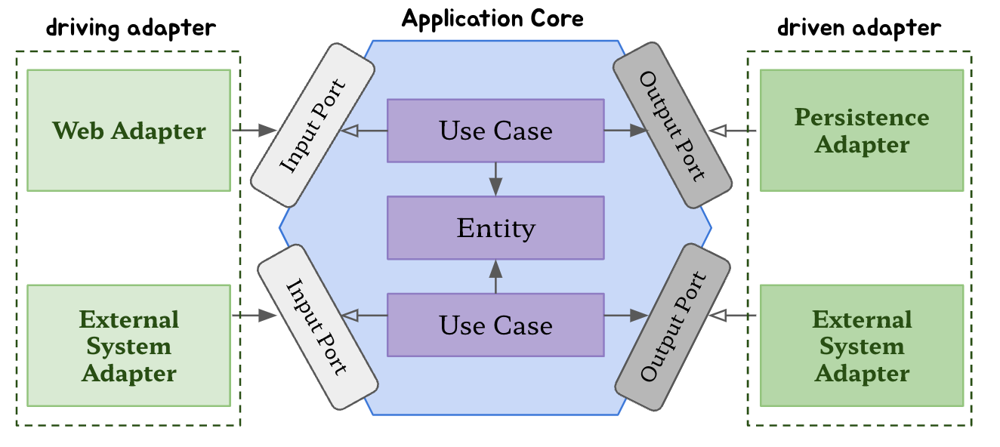

## 헥사고날 아키텍처란?

알리스테어 콕번(Alistair Cockburn)이 2005년에 제안한 소프트웨어 아키텍처 패턴으로, **Ports & Adapters 패턴**이라고도 불린다.

핵심 아이디어는 단 하나다.

> **애플리케이션의 비즈니스 로직(도메인)을 외부 세계(DB, HTTP, 메시지큐 등)로부터 완전히 격리시킨다.**

전통적인 레이어드 아키텍처(Controller → Service → Repository)는 상위 레이어가 하위 레이어를 직접 의존하기 때문에,
DB나 프레임워크가 바뀌면 비즈니스 로직까지 함께 수정해야 하는 문제가 생긴다.
헥사고날 아키텍처는 이 문제를 **의존성 역전(DIP)** 으로 해결한다.

---

## 3계층 아키텍처와 비교

### 3계층 아키텍처 (Layered Architecture)

전통적인 Spring 애플리케이션에서 흔히 볼 수 있는 구조다.

```
[ Controller ]
      ↓ (직접 의존)
[   Service  ]
      ↓ (직접 의존)
[ Repository ]
      ↓
[     DB     ]
```

코드로 보면 이렇다.

```java
// 3계층: Service가 Repository를 직접 의존
@Service
public class ProductService {
    private final ProductRepository productRepository; // JPA Repository 직접 주입
}

// 3계층: Repository는 Spring Data JPA 인터페이스 그 자체
public interface ProductRepository extends JpaRepository<Product, UUID> {}
```

**문제점**: `ProductService`가 `ProductRepository`(JPA 기술)를 직접 알고 있다.
- DB를 MongoDB로 바꾸면 → Service 코드도 수정해야 한다
- Service를 단위 테스트하려면 → 실제 DB 또는 JPA Mock이 필요하다
- 비즈니스 로직과 기술 구현이 뒤섞인다

---

### 헥사고날 아키텍처

```
[ Controller ] → [ ProductUseCase 인터페이스 ] ← [ Service ]
                                                        ↓ (인터페이스만 안다)
                                          [ ProductPersistencePort 인터페이스 ]
                                                        ↑ (구현)
                                          [ ProductPersistenceAdapter ] → DB
```

코드로 보면 이렇다.

```java
// 헥사고날: Service는 Port(인터페이스)만 의존
@Service
public class ProductService implements ProductUseCase {
    private final ProductPersistencePort productPersistencePort; // 인터페이스만 안다
}

// 헥사고날: 실제 JPA 연결은 Adapter가 담당
@Repository
public class ProductPersistenceAdapter implements ProductPersistencePort {
    private final ProductJpaRepository productJpaRepository; // JPA는 여기서만
}
```

`ProductService`는 `ProductPersistencePort` 인터페이스만 알고, JPA가 뒤에 있는지 MongoDB가 있는지 모른다.

---

### 핵심 차이: 의존성의 방향

```
3계층:     Controller → Service → Repository(JPA)
                                  ^^^^^^^^^^^
                                  기술이 중심에 있다

헥사고날:  Controller → Service → Port(인터페이스) ← Adapter(JPA)
                                  ^^^^^^^^^^^^^^^^^
                                  인터페이스가 중심에 있다
```

3계층은 **기술(JPA)이 안쪽**에 있어서 도메인이 기술에 종속된다.
헥사고날은 **인터페이스(Port)가 중심**이고 기술(Adapter)이 바깥에서 구현하므로, 도메인이 기술로부터 독립된다.

---

### 한눈에 비교

| 항목 | 3계층 아키텍처 | 헥사고날 아키텍처 |
|------|-------------|----------------|
| 의존 방향 | Controller → Service → Repository | 모두 중심(Domain)을 향함 |
| Service가 아는 것 | JPA Repository | Port 인터페이스만 |
| DB 교체 시 | Service 수정 필요 | Adapter만 교체 |
| 단위 테스트 | JPA/DB 필요 | Mock Port로 충분 |
| 코드 복잡도 | 낮음 | 높음 (파일 수 증가) |
| 적합한 상황 | 소규모, 단순 CRUD | 복잡한 도메인, 장기 유지보수 |

> 헥사고날이 무조건 좋은 건 아니다. 파일과 인터페이스가 많아져 단순한 프로젝트에서는 오히려 과한 구조가 될 수 있다.
> 도메인 로직이 복잡하고 장기 유지보수가 필요한 서비스에서 진가를 발휘한다.

---

## 구조 개요

```
외부 세계 (HTTP, DB, Message Queue, ...)
        ↓ ↑
    [ Adapter ]       ← 외부와 내부를 연결하는 변환기
        ↓ ↑
     [ Port ]         ← 내부가 외부에게 요구하는 계약(인터페이스)
        ↓ ↑
  [ Application ]     ← 비즈니스 로직 (UseCase, Service)
        ↓ ↑
    [ Domain ]        ← 핵심 도메인 모델 (Entity, Value Object)
```

중심부(도메인 + 애플리케이션)는 외부를 **전혀 모른다.**
외부(어댑터)가 중심부에 맞춰서 변환하는 구조다.

---

## 핵심 개념

### 1. Domain (도메인)
비즈니스의 핵심 개념과 규칙을 담는 곳. 프레임워크나 DB에 대한 의존이 없어야 한다.

```
product/domain/Product.java
```

### 2. Port (포트)
도메인과 외부 세계 사이의 **계약(인터페이스)** 이다. 두 종류가 있다.

| 종류 | 방향 | 역할 | 예시 |
|------|------|------|------|
| **Inbound Port** | 외부 → 내부 | 외부가 애플리케이션을 호출하는 진입점 | `ProductUseCase` |
| **Outbound Port** | 내부 → 외부 | 애플리케이션이 외부에게 요청하는 창구 | `ProductPersistencePort` |

**Inbound Port** - 외부(Controller)가 내부(Service)를 호출하기 위한 인터페이스
```java
// product/application/port/in/ProductUseCase.java
public interface ProductUseCase {
    ProductResponse create(ProductCreateRequest req);
    ProductResponse getById(UUID productId);
    List<ProductResponse> getAll();
    ProductResponse update(UUID productId, ProductUpdateRequest req);
    void delete(UUID productId);
}
```

**Outbound Port** - 내부(Service)가 외부(DB)에게 요청하기 위한 인터페이스
```java
// product/application/port/out/ProductPersistencePort.java
public interface ProductPersistencePort {
    Product save(Product product);
    Optional<Product> findById(UUID productId);
    List<Product> findAll();
    void delete(Product product);
}
```
> Service는 JPA가 뭔지, PostgreSQL이 뭔지 모른다. `ProductPersistencePort`라는 인터페이스만 알 뿐이다.

### 3. Application (애플리케이션)
비즈니스 유스케이스를 실제로 구현하는 곳. Inbound Port를 구현하고, Outbound Port를 사용한다.

```java
// product/application/service/ProductService.java
@Service
public class ProductService implements ProductUseCase {      // Inbound Port 구현

    private final ProductPersistencePort productPersistencePort;  // Outbound Port 사용

    public ProductResponse create(ProductCreateRequest req) {
        Product product = Product.create(...);
        Product saved = productPersistencePort.save(product);   // DB가 뭔지 모른다
        return ProductResponse.of(saved);
    }
}
```

### 4. Adapter (어댑터)
Port를 실제로 구현해서 외부 세계와 연결하는 변환기. 두 종류가 있다.

| 종류 | 방향 | 역할 | 예시 |
|------|------|------|------|
| **Inbound Adapter** | 외부 → 내부 | 외부 요청을 Port에 맞게 변환 | `ProductControllerImpl` |
| **Outbound Adapter** | 내부 → 외부 | Port 요청을 실제 외부 기술로 변환 | `ProductPersistenceAdapter` |

**Inbound Adapter** - HTTP 요청을 받아 UseCase(Inbound Port)를 호출
```java
// product/adapter/in/web/ProductControllerImpl.java
@RestController
public class ProductControllerImpl implements ProductController {

    private final ProductUseCase productUseCase;  // Inbound Port에만 의존

    public ResponseEntity<ProductResponse> create(ProductCreateRequest req) {
        ProductResponse response = productUseCase.create(req);
        return ResponseEntity.status(HttpStatus.CREATED).body(response);
    }
}
```

**Outbound Adapter** - Outbound Port를 실제 JPA로 구현
```java
// product/adapter/out/persistence/ProductPersistenceAdapter.java
@Repository
public class ProductPersistenceAdapter implements ProductPersistencePort {  // Outbound Port 구현

    private final ProductJpaRepository productJpaRepository;  // 실제 JPA

    @Override
    public Product save(Product product) {
        return productJpaRepository.save(product);
    }
}
```

---

## 전체 흐름 정리

```
HTTP 요청
    ↓
ProductControllerImpl (Inbound Adapter)
    ↓  ProductUseCase 호출 (Inbound Port)
ProductService (Application)
    ↓  ProductPersistencePort 호출 (Outbound Port)
ProductPersistenceAdapter (Outbound Adapter)
    ↓
ProductJpaRepository → PostgreSQL
```

각 계층이 **인터페이스(Port)** 를 통해서만 소통하기 때문에, 어느 한 쪽을 교체해도 나머지는 수정할 필요가 없다.

---

## 왜 쓰는가?

| 장점 | 설명 |
|------|------|
| **테스트 용이성** | Service 테스트 시 실제 DB 없이 Mock Port만으로 테스트 가능 |
| **기술 교체 용이성** | JPA → MongoDB로 바꿔도 Service 코드는 변경 없음 |
| **비즈니스 로직 보호** | 프레임워크 업그레이드, DB 마이그레이션이 도메인에 영향을 주지 않음 |
| **관심사 분리** | 각 레이어의 역할이 명확해 코드 파악이 쉬움 |

---

## 프로젝트 패키지 구조

```
product/
├── domain/
│   └── Product.java                          # 핵심 도메인 모델
│
├── application/
│   ├── port/
│   │   ├── in/
│   │   │   └── ProductUseCase.java           # Inbound Port (인터페이스)
│   │   └── out/
│   │       └── ProductPersistencePort.java   # Outbound Port (인터페이스)
│   └── service/
│       └── ProductService.java               # 비즈니스 로직 구현체
│
├── adapter/
│   ├── in/
│   │   └── web/
│   │       ├── ProductController.java        # Swagger 인터페이스
│   │       └── ProductControllerImpl.java    # Inbound Adapter (HTTP)
│   └── out/
│       └── persistence/
│           ├── ProductJpaRepository.java     # Spring Data JPA
│           └── ProductPersistenceAdapter.java # Outbound Adapter (DB)
│
└── dto/
    ├── in/
    │   ├── ProductCreateRequest.java
    │   └── ProductUpdateRequest.java
    └── out/
        └── ProductResponse.java
```